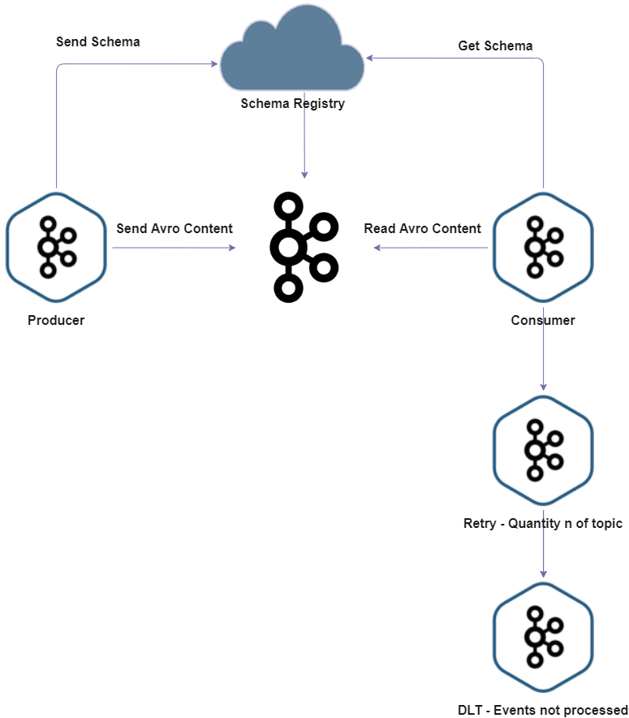

<div align="center">


</div>

<div align="center">

# POC - Springboot, Java, Schema Registry, Apache Avro e Apache Kafka.
Trata-se de uma aplicação de prova de conceito para desenvolver um consumer com retry e DLT, e um producer kafka, utilizando arquitetura: Springboot, Java, Schema Registry, Apache Avro e Apache Kafka.


</div> 

<div align="center">

## Arquitetura


</div>

## Fundamentos teóricos

> Springboot: O Spring Boot é um projeto da Spring que veio para facilitar o processo de configuração e publicação de nossas aplicações. A intenção é ter o seu projeto rodando o mais rápido possível e sem complicação.

> Apache Kafka: Apache Kafka é uma plataforma open-source de processamento de streams desenvolvida pela Apache Software Foundation, escrita em Scala e Java. O projeto tem como objetivo fornecer uma plataforma unificada, de alta capacidade e baixa latência para tratamento de dados em tempo real.

> Schema Registry: O Schema Registry valida se a mensagem que está sendo enviada por uma aplicação é compatível. Podemos usar vários formatos de arquivos para criar os nossos schemas como XML, CSV, JSON mas aqui usaremos Apache Avro que é um formato desenvolvido para criação de schemas com tipagem.

> Apache avro: O Avro é uma estrutura de serialização de chamada e procedimento remoto orientada a linhas, desenvolvida no projeto Hadoop do Apache. Ele usa JSON para definir tipos e protocolos de dados e serializa dados em um formato binário.

> Java: Java é uma linguagem de programação orientada a objetos desenvolvida na década de 90 por uma equipe de programadores chefiada por James Gosling, na empresa Sun Microsystems. Em 2008 o Java foi adquirido pela empresa Oracle Corporation..

## Tecnologias
- Java 17
- Spring Boot 3.0.5
  - spring-boot-starter-web
  - spring-boot-starter-data-jpa
  - spring-boot-devtools
  - spring-kafka
- Apache Avro
- Lombok
- Tomcat (Embedded no Spring Boot)
- Git

## Execução

A execução das aplicações são feitas através do de um comando Maven que envoca a inicialização do Spring Boot.

- Scripts
  ### Executar docker-compose
  - ```docker-compose -f docker-compose.yml up```
  ### Compilar o modulo BOM
  - ``` ./mvnw clean install```
  ### Executar a aplicação producer
  -  ```cd poc-spring-kafka-producer/ ```
  -  ```./mvnw clean compile spring-boot:run```
  ### Executar a aplicação consumer
  -  ```cd poc-spring-kafka-consumer/ ```
  -  ```./mvnw clean compile spring-boot:run```

## Utilização
- Landoop UI em http://localhost:3030
- Efetuar uma requisição REST com verbo POST na seguinte URL: http://localhost:8083/persons/publish
- Payload
    ``` 
         {
            "name": "wesley",
            "age": 29,
            "cpf": "00000000000"     
          }
    ```  
